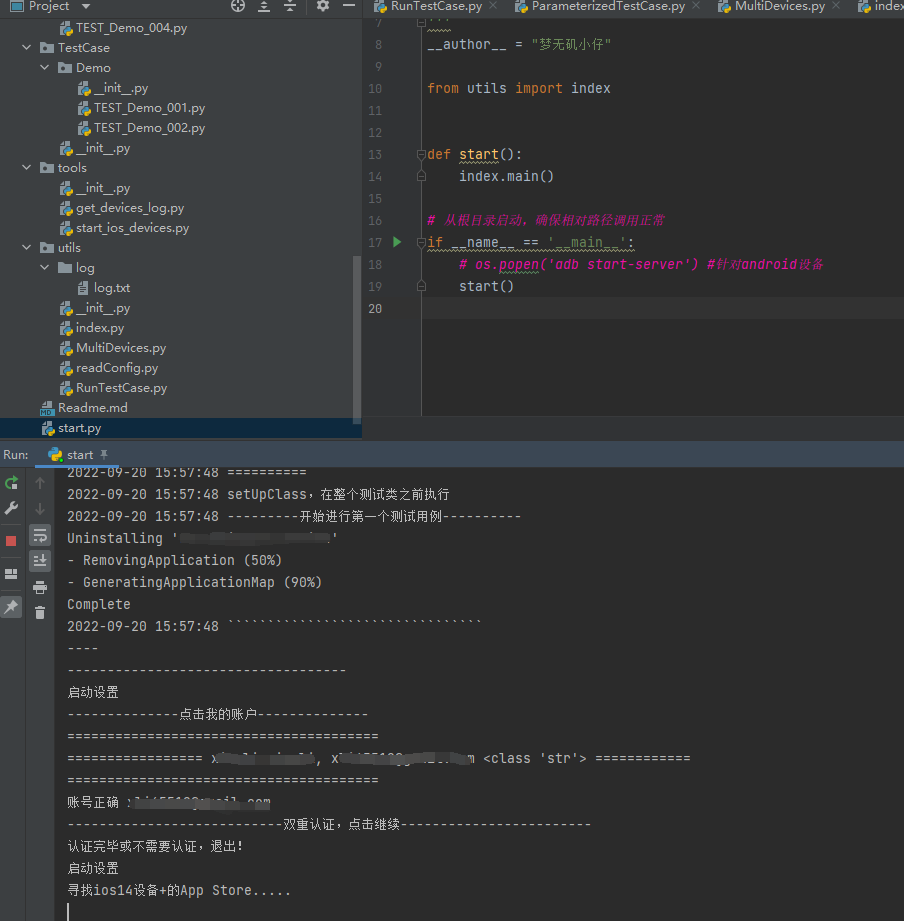

# IOS&Android多设备多进程自动化框架

主要是提供一个大致的框架思路

具体细节需要根据各自的项目进行相应的扩展

## 大致介绍
一款集Airtest+unittest+unittestreport+tidevice等于一体的多进程多设备自动化框架，兼容IOS、Android设备，兼容接入poco SDK的ios，android,unity,UE4，Cocos-lua,Cocos-C++,Cocos-js。

## 框架优点
#### 1.可扩展性强

可以根据需求，进行单设备多用例执行，多设备多用例执行，指定某个文件夹下所有用例执行。
兼容IOS，Android设备

#### 2.可移植性高

所写的TestCase即使不用本框架，也依然可以用unittest或者pytest单独运行,杜绝框架强依赖强绑定性。

#### 3.可维护性强

框架对IOS相关操作,如滑动，截图，用例失败重跑等进行了封装，使用者可以根据自己的需求进行其他相关封装，或直接导入自己已有的封装模块亦可。

#### 4.多进程运行

解决设备多，运行慢的问题。电脑cpu核素越高，性能越好，执行速度越快。

#### 5.极易上手

学习成本几乎为0，以各位的的能力，直接clone就开始玩。

### 框架展示

如下是整体的框架结构

### 功能预讲

1. 在TestCase文件夹下创建项目，再编写TestCase用例
2. 更改settings下的config.ini配置文件，将需要执行的设备及用例填写好
3. 打开start.py直接运行即可。

### 报告展示

### 其他展示

#### 运行截图

#### 多设备并发截图

### 开源地址

## 公众号
框架的详细教程请关注微信公众号：梦无矶的测试开发之路

**二维码**

